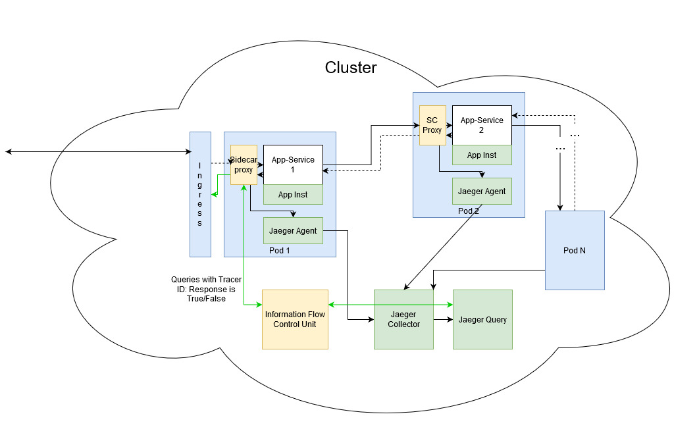
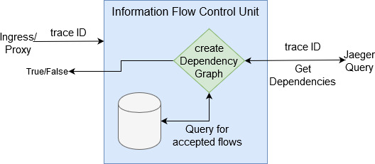

# Jaeger Proxy
It creates a sidecar proxy to be used with distributed applications in
a microservices/kubernetes setup. Proxy2 has a simple python proxy which inserts a jaeger tracing header into incoming HTTP requests.

This helps minimal changes to existing applications and create a tracing
infrastructure for looking at data-flow paths in large scale apps.

Pod contains IP Tables rule to forward any incoming application request to the
proxy's port.

# Usage
proxy_bookinfo.yaml is sample istio application which has the necessary proxy
and jaeger agent inserted.

Build proxy:

`cd proxy2`

Flask: `docker build -f Dockerfile -t <org-name>/flask_proxy`

Socket: `docker build -f Dockerfile_socket -t <org-name>/socket_proxy`

Build init pod:

`cd pod`

`docker build -f Dockerfile -t <org-name>/init-container`

Make sure that the bookinfo yaml file proxy/init-container image names are
properly set.

Push both these images to your org dockerhub:

`docker push <org-name>/<proxy/init-container>`

Setup kubernetes cluster by running install_tools.sh

Setup jaeger by running deploy_operator.sh

Deploy bookinfo: `kubectl apply -f proxy_bookinfo.yaml`

Access the bookinfo app: `<IP>:32080/productpage`

Access the jaeger UI: `<IP>:80/search`

# Design and Arch

